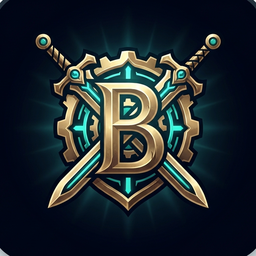

<p align="center">
  
</p>

<h1 align="center">BRADDRAFT</h1>

<p align="center">
  <b>Best Rotations And Designations</b> — a League of Legends draft optimizer for 5-stack premades.<br>
  It recommends champions ranked by a <b>calibrated win-probability model with honest error bars</b>,
  and reads your live champ select automatically.
</p>

<p align="center">
  <a href="https://github.com/thebrad-hash/lol-draft-assistant/releases/latest">
    
  </a>
  &nbsp;
  <a href="https://lol-draft-assistant-rho.vercel.app">
    
  </a>
</p>

---

## Download (Windows)

**[⬇ Download BRADDRAFT.exe](https://github.com/thebrad-hash/lol-draft-assistant/releases/latest)** — no install, no Python, nothing else needed.

1. Download `BRADDRAFT.exe` from the [latest release](https://github.com/thebrad-hash/lol-draft-assistant/releases/latest).
2. Double-click it. Windows SmartScreen may warn (it's an unsigned indie app) → **More info → Run anyway**. Some antivirus may flag it too — a common false positive for self-contained packaged apps.
3. Your browser opens to **http://localhost:8000** — the full app.
4. Launch League. In champ select, click **Go Live** and BRADDRAFT reads your draft automatically, showing the best picks in real time.

Everything runs on your own PC. It works whether or not anyone else is online.

> **Prefer the browser?** Use the hosted version at **[lol-draft-assistant-rho.vercel.app](https://lol-draft-assistant-rho.vercel.app)** — same app, plus shareable premade lobbies & team chat. (The hosted copy can't read your local League client, so live sync there is fed by an in-game teammate.)

## What you get

- **Calibrated win %** for every pick — a real probability from a logistic model fit on Riot Match-V5 games, not a raw z-score.
- **Honest error bars.** Every number ships with a 90% confidence interval from a 1000-sample bootstrap, and an unmistakable **"too close to call — pick on comfort"** flag when two picks are a statistical coin toss. The draft-only edge is genuinely small, and the tool says so instead of faking precision.
- **Best picks for all five roles at once**, with the counters and synergies driving each number.
- **Premade coordination** — every teammate's champion pool per role, shown *above* the global best list, so your squad can see who should swap to what at a glance.
- **Live champ-select sync** — reads your local League client, strictly read-only (never automates anything in-client).
- **Full-draft team analysis** once both teams lock in: favorability, lane-by-lane, and win conditions.

## Two ways to run it

| You want to… | Use | Live champ-select sync |
| --- | --- | --- |
| Auto-read your own champ select **and** broadcast it to a premade | **`BRADDRAFT.exe`** (this download) | ✅ yes — reads your local client; friends on the site follow |
| Share a link, manual entry, **premade lobby + chat**, follow live draft | the [hosted site](https://lol-draft-assistant-rho.vercel.app) | ⚙️ follow mode — someone in-game runs desktop (or the small broadcaster) |

**Premade without a dedicated host:** share the website lobby link with everyone.
Whoever is in champ select runs `BRADDRAFT.exe`, joins that lobby, leaves **Go Live**
on. Everyone else stays in the browser — no tunnels, no pasting lobby ids onto
someone else's localhost.

## How the numbers work

The ranking is a **calibrated logistic regression** over four team-level features (lane matchup, counter matchup, synergy, champion strength) → `P(win)`. It's validated **out-of-sample** (GroupKFold on match id, so a game's two anti-correlated rows never split): held-out AUC ≈ 0.568, log-loss 0.6866 — modestly better than additive-z (0.6892) and the 0.6931 coin-flip null, and well-calibrated (ECE ≈ 0.011).

A **bootstrap ensemble** (1000 refits, resampling whole games) turns each pick into a *distribution*, giving the median, 90% interval, and standard deviation you see on every card — and a distinguishability test that flags two picks as tied when the ordering is within noise. Champion win-rate uncertainty (a binomial proportion with known sample size) is propagated too, which roughly doubles the honest interval.

The z-score matchup/synergy data is decoded directly from [machineloling](https://pooldesigner.machineloling.com)'s static files, validated cell-for-cell against the site's own engine.

## Run from source (Mac / Linux / developers)

The `.exe` is Windows-only. On other platforms, or to hack on it:

```bash
pip install -r requirements.txt
python -m lol_draft.server          # serves UI + API on http://localhost:8000
```

Rebuild the web UI after frontend changes:

```bash
cd web && npm install && npm run build
```

Build the Windows desktop `.exe` yourself (see [`DESKTOP.md`](DESKTOP.md)):

```bash
cd web && npm run build && cd ..
build_desktop.bat                   # -> dist/BRADDRAFT.exe
```

More detail: [`CLAUDE.md`](CLAUDE.md) (architecture & conventions), [`STATUS.md`](STATUS.md) (project state), [`DEPLOY.md`](DEPLOY.md) (hosting).

## Tech

Python + FastAPI engine · React 18 + Vite + TypeScript UI (hextech "champ-select" design) · calibrated logistic win-prob model with a bootstrap uncertainty ensemble · champion art from Riot Data Dragon · one-file PyInstaller desktop build · deployed on Vercel.

---

<sub><b>BRADDRAFT is a fan-made, non-commercial tool. It is not affiliated with, endorsed, or sponsored by Riot Games.</b> League of Legends and all associated assets are trademarks or registered trademarks of Riot Games, Inc.</sub>
